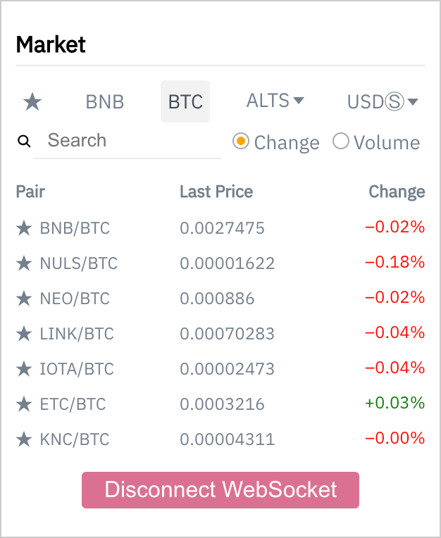

# Binance widget



Cryptocurrency prices in real-time. [Live version](https://bi-widget-svelte.vercel.app/)
This is **Svelte** version of widget.
ReactJS version avaliable [here](https://github.com/enemycnt/bi-widget)

### Built With

- [Svelte](https://svelte.dev/)
- [svelte-virtual-list](https://github.com/sveltejs/svelte-virtual-list)
- [nanostores](https://github.com/nanostores/nanostores)
- [Testcafe](https://devexpress.github.io/testcafe/)

### Prerequisites

To run the project correctly you need to install [yarn](https://classic.yarnpkg.com/en/docs/install/) and [chrome](https://www.google.com/chrome/) first

### Installing and running

A step by step series of examples that tell you how to get a development env running

Simply clone the repository

```
git clone git@github.com:enemycnt/bi-widget.git
cd bi-widget
```

then install dependencies

```
pnpm install
```

and finally run the app in dev

```
pnpm dev
```

## Building and running in production mode

To create an optimised version of the app:

```bash
pnpm build
```

You can run the newly built app with `pnpm start`.

## Running the tests

To run end to end tests you should run app in development mode

```
pnpm start
```

then run in another terminal tab/window

```
pnpm e2e
```

It starts testcafe tool and tests category change and text search
